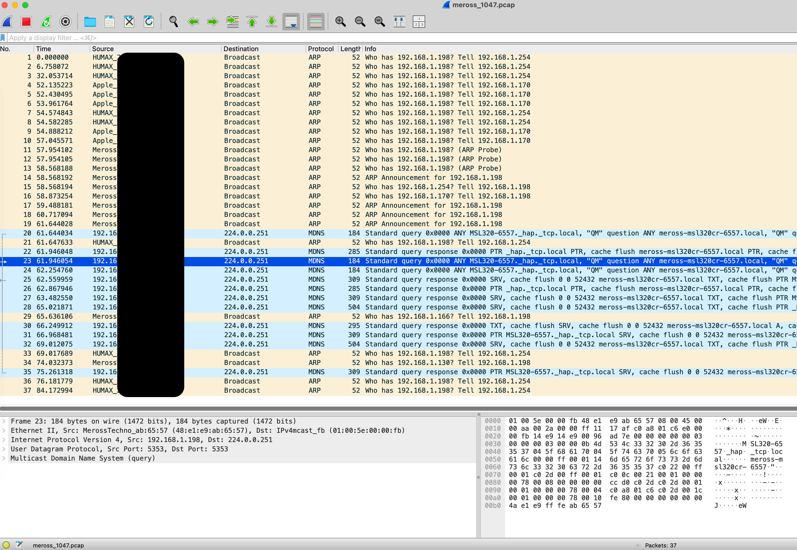

# Part 2: Meross Traffic Analysis — Watching the Smart Device Talk in Its Sleep

After completing initial recon and directory fuzzing on a Meross smart device (`MSL320`) in [Part 1](README.md), I pivoted to passive network monitoring to observe the device’s behavior over time. The goal was to answer one simple but important question:

> _What does this thing do when no one's watching?_

This phase involved setting up full packet capture using `tcpdump`, leaving it running overnight to collect data from the device at IP `192.168.1.198`.

---

## 🕵️ Objective

- Monitor all inbound and outbound traffic from the Meross device
- Identify any external domains or IPs contacted
- Detect the use of cloud APIs, encrypted communication, or local protocols like mDNS
- Spot potentially suspicious, undocumented, or excessive network activity

---

## 🧰 Tools Used

- `tcpdump` — for packet capture
- `Wireshark` — for analysis and filtering
- `Amphetamine` — to prevent macOS from sleeping during the overnight capture
- `curl` — for manual probing of discovered endpoints
- GitHub — for documenting this analysis in public

---

## 🧪 Capture Setup

The device was known to be on IP `192.168.1.198`. I used the following `tcpdump` command to capture all traffic to/from the device:

```bash
sudo tcpdump -i en0 host 192.168.1.198 -w meross_%H%M.pcap -G 3600
```



- en0 is the primary Wi-Fi interface on my MacBook
- The capture was allowed to run for ~12 hours (overnight)
- Amphetamine was used to prevent the system from entering sleep mode

---

## 🌐 Early Observations (Live Scroll)

Before analyzing the .pcap, I observed live tcpdump output showing repeated mDNS (Multicast DNS) traffic:

```text
IP 192.168.1.198.mdns > mdns.mcast.net.mdns: 0*- [0q] PTR MSL320-6557._hap._tcp.local.
```

This suggested:
- The device was broadcasting its availability via Bonjour/ZeroConf
- It was announcing itself as a HomeKit-compatible light (_hap._tcp.local)
- Meross uses the lwIP stack and is actively participating in local service discovery

---

## 🔬 Key Findings

### 🔹 1. Port 80 is Open, but Unused

No traffic was observed to or from **TCP port 80** on the Meross device during:

- Overnight automation cycles
- Manual use via Apple Home or Meross app
- Power cycle and reboots

Manual probing (via `curl` and `Gobuster`) produced no meaningful responses — only closed connections or empty replies.

**Conclusion:** Port 80 is likely a **leftover from the setup process** (e.g., onboarding/pairing), or a **dormant LAN API** that only activates under specific conditions (like pairing via Meross app). It is not used in normal operation by HomeKit or the app.

### 🌍 2. No External Traffic Observed

During 12+ hours of packet capture:

- **No HTTP or HTTPS traffic** to external IPs or domains
- **No traffic to known Meross or third-party cloud services**

Only outbound traffic was:
```text
dst = 224.0.0.251 (UDP 5353)
```

Which is expected for mDNS (Multicast DNS) used by HomeKit and Bonjour.

Even during:
- Scheduled automations via Apple Home app
- App interactions (on/off, color changes, etc)
- Full power-cycle reboots (manually unplugged)

The device did not attempt to connect to anything outside the local network.

**Conclusion**: When used via Apple HomeKit, the Meross MSL320 appears to be a true LAN-only device. It does not phone home, contact Meross servers, or leak data outside the local subnet.

## 🔁 3. Power-Cycle Behavior

When the device was unplugged and plugged back in:
- It broadcasted mDNS re-announcements using _hap._tcp.local
- Re-registered its HomeKit service identity and MAC address
- Sent several mDNS packets to 224.0.0.251

But again:
- No outbound cloud traffic
- No port 80 traffic
- No DNS lookups

**Conclusion**: The device advertises itself locally on reboot, per the HomeKit protocol, but performs no external communication during boot.

---

## 🧠 Assessment

The Meross MSL320 strip light, when configured via Apple HomeKit, behaves like a quiet, local-only smart device. No evidence of cloud dependency or telemetry was found. Port 80 remains open but unused.

---

## ✅ Next Steps

In [Part 3](PART-3.md) I will present my complete findings.
