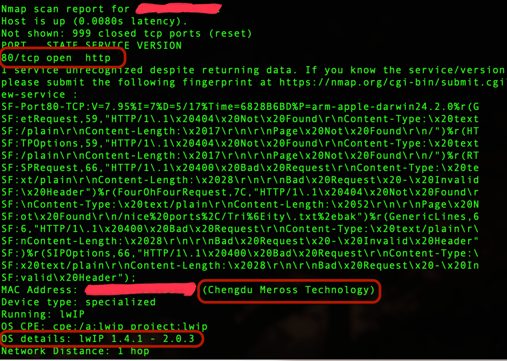
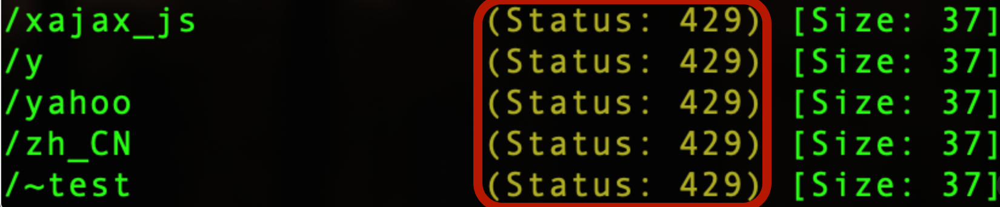

# Dissecting a Meross IoT Device: Local Recon, Rate Limiting, and Web Fuzzing

**Author:** Bryan Peabody

**Date:** May 2025

**Goal:** Explore and assess the network behavior and local web interface of a Meross smart device on my home network as part of my transition into red team cybersecurity.

---

# 🔍 Background

As part of a personal exploration into IoT security, I decided to investigate several Meross smart devices deployed on my local network. While these devices are cheap and functional, I’ve never fully trusted them. My goal was to analyze their surface exposure, understand their network behavior, and determine what kind of control interfaces were exposed — if any.

---

# 🎯 Objectives

- Identify the Meross devices on the network
- Determine exposed services/ports
- Analyze web interface behavior and potential APIs
- Bypass rate limiting and attempt basic fuzzing
- Evaluate potential security concerns

---

# 🛠️ Tools Used

- `nmap`
- `tcpdump`
- `Gobuster`
- `curl`
- `SecLists` wordlists (common.txt, raft-small-words.txt)

---

# 🔎 Device Discovery & Port Scanning

I started with an Nmap scan to enumerate hosts and services on my network:

```bash
sudo nmap -O -sV -Pn 192.168.1.0/24
```


### 🔎 Observations
- Only port 80 (HTTP) is open — no HTTPS
- The device runs lwIP, a lightweight TCP/IP stack used in constrained embedded devices
- HTTP service responded with 404s and Bad Request, suggesting a custom or minimalist web server

---

# 🌐 Web Interface Fuzzing with Gobuster

Initial scan with Gobuster using the common.txt wordlist:

```bash
gobuster dir \
-u http://192.168.1.202 \
-w /usr/share/seclists/Discovery/Web-Content/common.txt \
-t 50 \
-x html,txt,json,php \
-s 200,204,301,302,401,403 \
--status-codes-blacklist "" \
-q --no-error \
-o gobuster_meross.txt
```

## ⚠️ Problem: HTTP 429 — Too Many Requests

The device responded with Status: 429 for too many requests. This confirmed the device was applying rate limiting on directory scans — uncommon for low-end IoT devices.



## 🐢 Throttling the Scan

To bypass rate limits, I wrote a bash wrapper script to slow down Gobuster by applying a delay of 500ms to requests and reduce threads:

```bash
#!/bin/bash

# Gobuster throttle wrapper

# === CONFIG ===
TARGET="http://192.168.1.202"
WORDLIST="/Users/bryanpeabody/Source/SecLists/Discovery/Web-Content/common.txt"
THREADS=5
DELAY="500ms"
OUTPUT="meross.txt"

# === RUN ===
gobuster dir \
  -u "$TARGET" \
  -w "$WORDLIST" \
  -t "$THREADS" \
  --delay "$DELAY" \
  -o "$OUTPUT" \
  -q --no-error
```

## ✅ Result:
- Rate limiting was bypassed successfully
- Only one endpoint was found: /config

---

# 🧪 Retesting with RAFT Wordlist

Switching to a smaller, more focused wordlist:
```bash
/Users/bryanpeabody/Source/Discovery/Web-Content/raft-small-words.txt
```
## ✅ Result:
- No other significant directories were discovered during this scan

---

# 🔹 Rate Limiting and Abuse Resistance

As part of initial probing, I tested the /config endpoint to evaluate whether it implemented any form of rate limiting or abuse prevention. Using a controlled loop, I sent over 50 rapid POST requests with invalid payloads to the endpoint, both with and without intentional delay between attempts.

All requests resulted in the same behavior:
- A TCP connection was established successfully
- No HTTP status code or response body was returned
- Curl consistently reported a status code of 000, indicating an empty or dropped response

No change in behavior was observed across repeated attempts, and no evidence of application-layer throttling, connection resets, or blocking mechanisms were present. Packet analysis confirmed that the device continued to accept and ignore all requests identically.

**Conclusion**: The /config endpoint appears to implement no rate limiting or abuse detection. While not exploitable in its current silent state, this behavior demonstrates a lack of basic protections and could present risk if future firmware versions introduce exploitable logic.

---

# 🔍 Speculative Analysis

## 🌐 Why is Port 80 Open?
- Likely exposes a local HTTP API used by the Meross app on the same network.
- Given the discovered /config endpoint, it's possible this is used for initial setup/pairing
- Absence of HTTPS suggests cost-cutting and low processing power on the device
- Possible debug or undocumented interfaces left in firmware
- Presence of rate limiting at the directory level but not specific endpoints (/config) shows some awareness of abuse vectors, but no authentication or encryption is still a security risk.

---

## 🚪 Next Steps
In [Part 2: Meross Traffic Analysis](PART-2.md), we will inspect traffic to and from the device overnight.